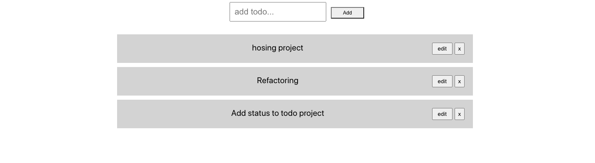
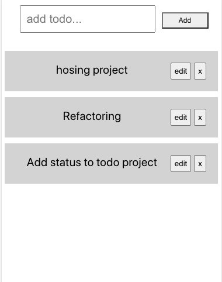

# Todo
This small web application helps the user to add todo's, display all todo's as a list, delete and update each todo depending on the requirement.

### Tech stack
React, firebase

### For Developers
- https://github.com/manasarjun/todo.git
- `cd todo`
- `npm i`
- `npm start`

### Preview

- Desktop view

- Mobile view

